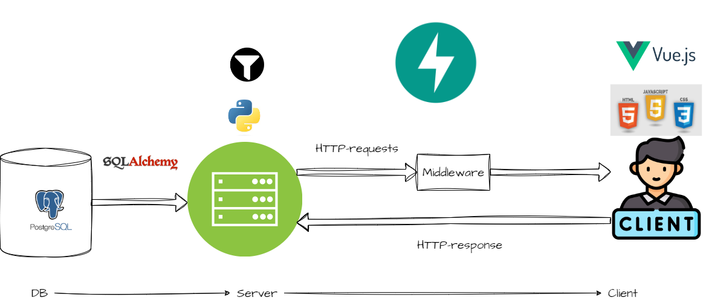

# **DataDolphins Applicatie Overzicht**

## Intro
This project is setup for demo purposes for DataDolphins. The architecture of the software including libraries is as follows:

### Prerequisites

The following tooling is required:

- Docker
- Node.js. The version is specified in `frontend/.nvmrc`. It is recommended to use use [Node version manager](https://github.com/nvm-sh/nvm), the correct Node version can then be activated with with `nvm use`.
- Python. The version is specified in `backend/.python-version`. It is recommended to use [pyenv](https://github.com/pyenv/pyenv) to switch between Python versions.
- Poetry. See the [docs](https://python-poetry.org/docs/#installation) for installation instructions.

### Setup development environment
### Frontend
__Install dependencies:__

- Navigate to `/frontend/` and install packages with `npm install`.

__Linting:__

This project uses Volar. Install Volar in Visul Studio Code and enable [take over mode](https://github.com/johnsoncodehk/volar/discussions/471) to prevent unnecessary tslint errors:

1. Run Extensions: Show Built-in Extensions command
2. Update Volar to latest version.
3. Run Extensions: Show Built-in Extensions command
4. Find TypeScript and JavaScript Language Features, right click and select Disable (Workspace)
5. Reload VSCode.

### Backend
__Install dependencies:__

1. `poetry env use <python_version>`. The Python version is specified in `backend/.python-version`.
2. `poetry install`

### Start development environment
0. Navigate to `/backend/`
1. Start database: `docker compose up -d dbgate`
2. If environment is not activated: `poetry shell`
3. Navigate to `/backend` and run `poetry run uvicorn app.main:app --reload`
4. Navigate to `/frontend` and run `npm run serve`.

### Other
#### General
- Reset database and initialize: `docker compose down && docker volume rm datadolphins_applicatie && docker compose up -d dbgate`
